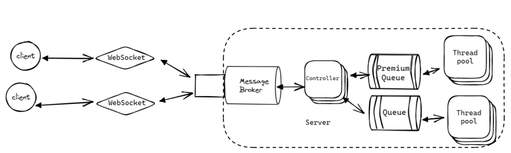

Cient-server communication via STOMP messaging protocol over WebSocket.

Client can create requests to calculate a Fibonacci number with high or low priority.
And on the server side there are two thread pools one for every priority. 
Leveraging @Async annotation and its customization for configuring capacity of the queue and
number of threads in pools.

````java
    private Executor getExecutor() {
        ThreadPoolTaskExecutor executor = new ThreadPoolTaskExecutor();
        executor.setCorePoolSize(2);
        executor.setMaxPoolSize(2);
        executor.setQueueCapacity(5);
        executor.setRejectedExecutionHandler(new ThreadPoolExecutor.CallerRunsPolicy());
        executor.setThreadNamePrefix("Async_Thread_");
        executor.setWaitForTasksToCompleteOnShutdown(true);
        executor.initialize();
        return executor;
    }
````
````java
    @Async("CustomAsyncExecutor")
    public CompletableFuture<Response> response(@Payload Task task, Principal user) throws InterruptedException {
````

